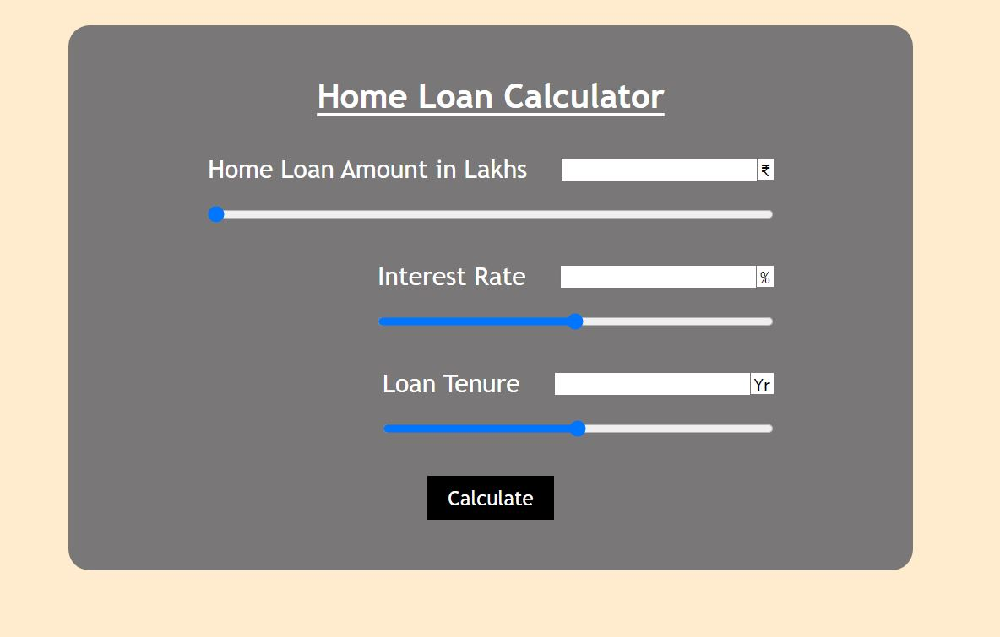

# ⭐ Project - Loan Calculator  ⭐

This  project of javascript is made from pure HTML,CSS and Javascript.

I got this assignment from iNeuron Bootcamp.

 

📌 Learnings:

👉 1\. Handling input event listeners with number and range. 
👉 2\. Intl.NumberFormat object for converting numbers into currency with specific country and number format. 

 

> Time taken to build this project is 2 hour.

  

## Links

[Link](https://javascriptmyloancalculator.netlify.app/)

[Linkedin](https://www.linkedin.com/in/pratyush-kesarwani-2b6601171/)

### Acknowledgements:

I am thankful to Hitesh Choudhary sir, Anurag sir and iNeuron team for this amazing bootcamp.
